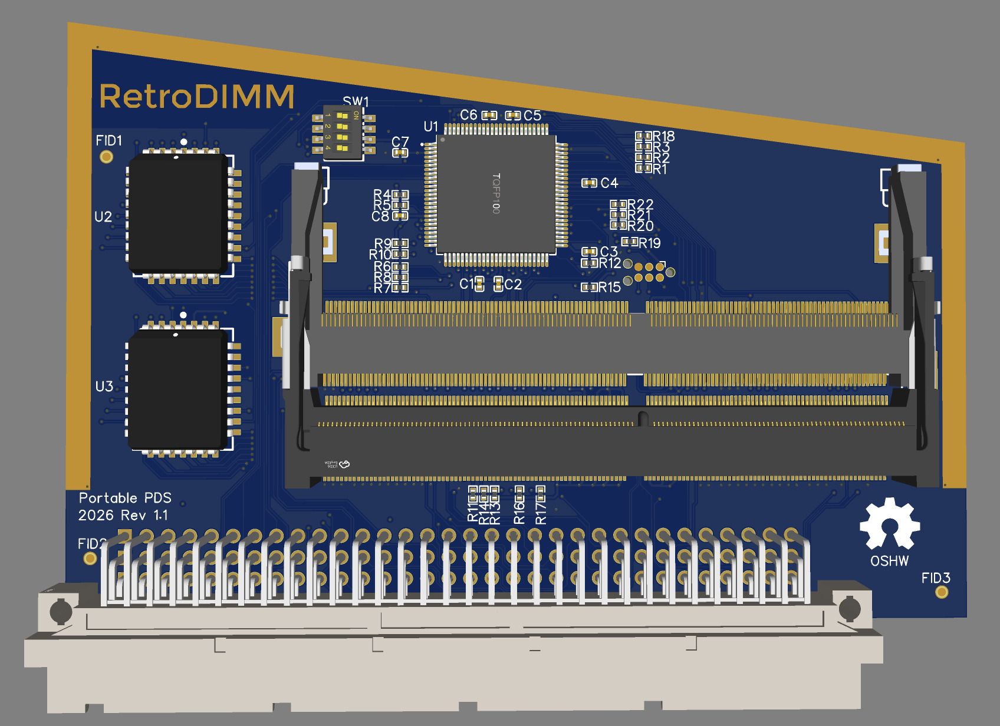
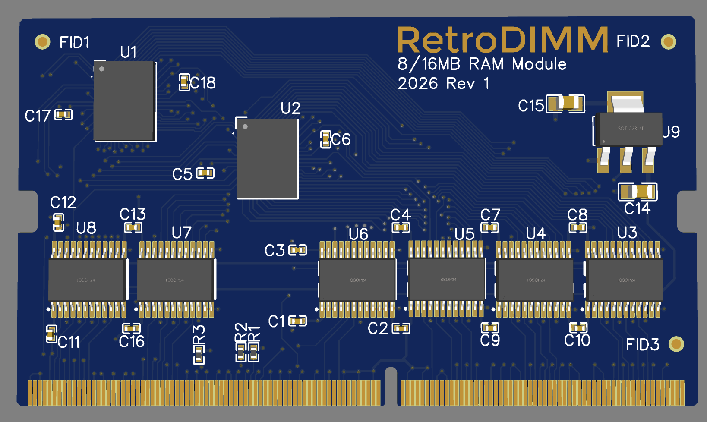
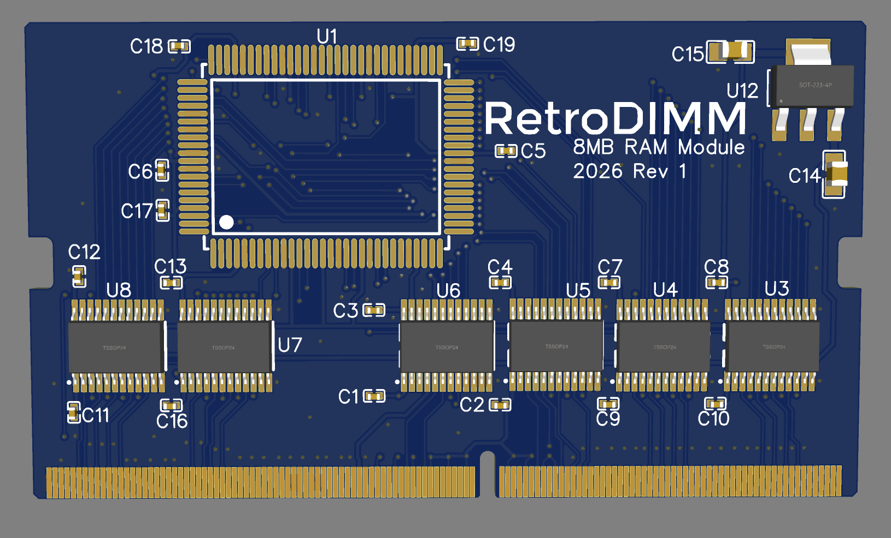

# RetroDIMM

This page is still a work in progress.

## Table of Contents

1. [Pinout](#pinout)
1. [Signal Descriptions](#signal-descriptions)
1. [Detailed Signal Descriptions](#detailed-signal-descriptions)
1. [Boards and Designs](#boards-and-designs)

## Pinout

| Pin | Signal | Pin | Signal | Pin | Signal | Pin | Signal |
| --: | :----- | --: | :----- | --: | :----- | --: | :----- |
| 1 | GND | 2 | GND | 3 | NC | 4 | NC |
| 5 | GND | 6 | GND | 7 | NC | 8 | DOEH |
| 9 | GND | 10 | GND | 11 | DIR | 12 | D15 |
| 13 | D14 | 14 | GND | 15 | GND | 16 | D13 |
| 17 | D12 | 18 | GND | 19 | GND | 20 | D11 |
| 21 | D10 | 22 | GND | 23 | GND | 24 | D9 |
| 25 | D8 | 26 | GND | 27 | GND | 28 | NC |
| 29 | NC | 30 | GND | 31 | GND | 32 | NC |
| 33 | NC | 34 | NC | 35 | GND | 36 | GND |
| 37 | NC | 38 | NC | 39 | GND | 40 | GND |
| 41 | NC | 42 | NC | 43 | GND | 44 | GND |
| 45 | NC | 46 | DOEL | 47 | GND | 48 | GND |
| 49 | D7 | 50 | D6 | 51 | GND | 52 | GND |
| 53 | D5 | 54 | D4 | 55 | D3 | 56 | GND |
| 57 | GND | 58 | D2 | 59 | D1 | 60 | GND |
| 61 | GND | 62 | D0 | 63 | NC | 64 | GND |
| 65 | GND | 66 | NC | 67 | RAM_4CHIP | 68 | GND |
| 69 | GND | 70 | RAM_2CHIP | 71 | ROM_SENSE | 72 | GND |
| 73 | GND | 74 | NC | 75 | NC | 76 | NC |
| 77 | GND | 78 | GND | 79 | NC | 80 | NC |
| 81 | GND | 82 | GND | 83 | RAM_SENSE | 84 | NC |
| 85 | GND | 86 | GND | 87 | NC | 88 | RAM_SIZx |
| 89 | GND | 90 | GND | 91 | RAM_SIZx | 92 | RAM_SIZx |
| 93 | GND | 94 | GND | 95 | RAM_SIZx | 96 | RAM_SIZx |
| 97 | RAM_SIZhalf | 98 | GND | 99 | GND | 100 | 2WS |
| 101 | NC | 102 | GND | 103 | GND | 104 | 1WS |
| 105 | CLOCK | 106 | GND | 107 | GND | 108 | DTACK |
| 109 | BUSY | 110 | SLEEP | 111 | VCC | 112 | VCC |
| 113 | NC | 114 | NC | 115 | NC | 116 | NC |
| 117 | VCC | 118 | VCC | 119 | NC | 120 | NC |
| 121 | CS1 | 122 | CS2 | 123 | VCC | 124 | VCC |
| 125 | CS3 | 126 | CS4 | 127 | LW | 128 | UW |
| 129 | VCC | 130 | VCC | 131 | A32 | 132 | A31 |
| 133 | A30 | 134 | A29 | 135 | VCC | 136 | VCC |
| 137 | A28 | 138 | A27 | 139 | A26 | 140 | A25 |
| 141 | VCC | 142 | VCC | 143 | PARITY_L | 144 | PARITY_H |
| 145 | VPP | 146 | VPP | 147 | VCC | 148 | VCC |
| 149 | NC | 150 | NC | 151 | NC | 152 | NC |
| 153 | VCC | 154 | VCC | 155 | NC | 156 | NC |
| 157 | WE | 158 | OE | 159 | VCC | 160 | VCC |
| 161 | NC | 162 | A24 | 163 | VCC | 164 | A23 |
| 165 | A22 | 166 | A21 | 167 | GND | 168 | GND |
| 169 | A20 | 170 | A19 | 171 | GND | 172 | GND |
| 173 | A18 | 174 | A17 | 175 | GND | 176 | GND |
| 177 | NC | 178 | NC | 179 | NC | 180 | GND |
| 181 | GND | 182 | NC | 183 | NC | 184 | GND |
| 185 | GND | 186 | NC | 187 | NC | 188 | GND |
| 189 | GND | 190 | NC | 191 | NC | 192 | GND |
| 193 | GND | 194 | NC | 195 | A16 | 196 | GND |
| 197 | GND | 198 | A15 | 199 | A14 | 200 | A13 |
| 201 | GND | 202 | GND | 203 | A12 | 204 | A11 |
| 205 | GND | 206 | GND | 207 | A10 | 208 | A9 |
| 209 | GND | 210 | GND | 211 | NC | 212 | NC |
| 213 | GND | 214 | GND | 215 | NC | 216 | NC |
| 217 | GND | 218 | GND | 219 | NC | 220 | NC |
| 221 | NC | 222 | GND | 223 | GND | 224 | NC |
| 225 | NC | 226 | GND | 227 | GND | 228 | NC |
| 229 | NC | 230 | GND | 231 | GND | 232 | NC |
| 233 | A8 | 234 | GND | 235 | GND | 236 | A7 |
| 237 | A6 | 238 | GND | 239 | GND | 240 | A5 |
| 241 | A4 | 242 | A3 | 243 | GND | 244 | GND |
| 245 | A2 | 246 | A1 | 247 | GND | 248 | GND |
| 249 | NC | 250 | NC | 251 | GND | 252 | GND |
| 253 | Available | 254 | Available | 255 | Available | 256 | Available |
| 257 | Available | 258 | Available | 259 | Available | 260 | Available |

## Signal Descriptions

| Signal | Description | Source | Unused - Module | Unused - Controller |
| --- | ----------- | ---- | ------------- | ----------------- |
| BUSY | | Module | Leave floating | Leave floating or pull up |
| CHIP (2CHIP & 4CHIP) | | Module | Leave floating | Leave floating |
| CLOCK | Clock for RAM, typically the main system clock. The controller should always provide some sort of clock if possible for maximum compatibility. | Controller | Leave floating | Pull up or down |
| CS1 - CS4 | Chip select for up to four chips. | Controller | Leave floating | Required/Pull up |
| DIR | Direction control for bus transceivers. High = write to module. | Controller | Leave floating | Required |
| SLEEP | Puts module components into a low power state. High = sleep mode. | Controller | Leave floating | Pull down/Ground |
| DOEH & DOEL | Output enables for bus transceivers. | Controller | Leave floating | Required |
| DTACK | Active low signal to complete a bus transaction. | Controller/Module | Leave floating | Pull up |
| LW & UW | | Controller |
| RAM_SENSE | Identifies the module as RAM | Module |
| ROM_SENSE | Identifies the module as ROM | Module |
| SLEEP | Puts module components into a low power state | Controller | Leave floating | Pull down |
| RAM_SIZ[N] | | Module | Leave floating | Leave floating |
| RAM_[1/2]WS | Number of wait states when accessing RAM | Module | Leave floating/Pull down | Leave floating |
| VCC | Supply voltage, typically +5V | Controller | Required | Required |
| VPP | Future use for programming | Controller | Leave floating | Pull up |
| NC | Not connected |

## Detailed Signal Descriptions

## Boards and Designs

Board designs are currently in testing.

